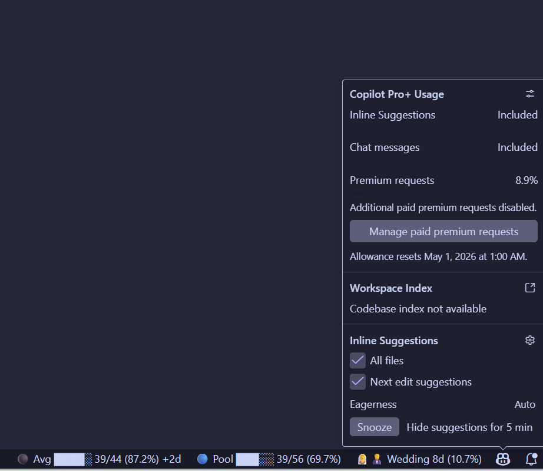

# oQuota

oQuota shows quota and progress counters on the right side of the Visual Studio Code status bar.

It is built for recurring visibility problems such as:

- monthly billing cycles
- year progress
- workday progress such as 09:00 to 17:00
- custom date ranges
- deadline countdowns
- GitHub Copilot premium interaction pacing

Each counter is its own status bar item. Labels are optional. For Copilot `Consumption`, `Pool`, and `Average`, oQuota falls back to those captions when the label is empty.


## Screenshot



## Features

- Flexible number of counters instead of a fixed three-slot layout
- Default counter that shows the current day of the year
- Monthly, yearly, workday, date-range, deadline, and Copilot modes
- Fixed refresh cadence: Copilot every 60 seconds, workday counters every 60 seconds, everything else every hour
- Add, configure, and remove counters from the Command Palette
- Copilot progress modes with colored state circles, compact bars, and pacing projections
- Local Copilot snapshot history used to anchor tracking from the first local observation

## Example Status Bar Output

- `📆 Day of Year 94/365 (26%)`
- `⏳ Ship 12d (71%)`
- `Copilot 1405 (93.6%)`
- `Copilot 95 (6%)`
- `🔵 Consumption 10.0% 6.0%`
- `🟢 Pool █░░░░ 25/250 (10.0%)`
- `⚫ Average ██░░░ 25/50 (50.0%) +2d`

In Copilot modes, the colored state circle replaces the configured emoji in the status bar.


## Commands

- `oQuota: Open Settings`
- `oQuota: Configure Counter`
- `oQuota: Add Counter`
- `oQuota: Remove Counter`

Use `Ctrl+P`, type `>oQuota`, and run the commands to add, edit, or delete counters quickly from the Command Palette.

The guided commands are the easiest way to work with counters because the stock VS Code Settings UI cannot truly hide mode-specific fields.

## Settings

### Counters

`oquota.counters` is an array of counter objects. Each object supports:

- `enabled`
- `label`
- `emoji`
- `mode`: `day-of-year`, `month`, `year`, `day`, `range`, `deadline`, or `copilot`
- `monthlyCycleDay`
- `dailyStartTime`
- `dailyEndTime`
- `rangeStartDate`
- `rangeEndDate`
- `deadlineDate`
- `copilotDisplayMode`

Example `settings.json`:

```json
{
  "oquota.counters": [
    {
      "enabled": true,
      "label": "Day of Year",
      "emoji": "📆",
      "mode": "day-of-year"
    },
    {
      "enabled": true,
      "label": "Billing",
      "emoji": "💼",
      "mode": "month",
      "monthlyCycleDay": 3
    },
    {
      "enabled": true,
      "label": "Launch",
      "emoji": "⏳",
      "mode": "deadline",
      "deadlineDate": "2026-06-30"
    },
    {
      "enabled": true,
      "label": "Copilot",
      "emoji": "🤖",
      "mode": "copilot",
      "copilotDisplayMode": "consumption"
    }
  ]
}
```

## Mode Notes

### Day of Year

Shows the current day number within the current year and the percentage of the year that has elapsed.

### Month

Uses a billing-cycle day from `1` to `31`. If a month is shorter than the chosen day, oQuota uses that month's last valid day.

### Year

Measures progress from the start of the current year to the start of the next year.

### Day

Measures the current day's progress between `dailyStartTime` and `dailyEndTime`.

### Range

Measures progress between `rangeStartDate` and `rangeEndDate`. The end date is inclusive.

### Deadline

Shows a countdown in days to `deadlineDate` and the proportion of the countdown window that has elapsed.

### Copilot

Copilot mode reads quota data from:

- `https://api.github.com/copilot_internal/user`

It uses the GitHub account already signed into VS Code.

Available Copilot display modes:

- `raw-remaining`: shows remaining premium interactions as the raw value and percentage, for example `1405 (93.6%)`
- `raw-consumption`: shows consumed premium interactions as the raw value and percentage, for example `95 (6.0%)`
- `consumption`: shows `theoretical cycle progress by billing-cycle day count` beside `actual consumed percent`, for example `10.0% 6.0%`
- `remaining-pool`: shows `today consumption/pool size (percent)` with the pool bar, where pool size is derived from the billing-cycle day target, for example `25/250 (10.0%)`
- `average-calibration`: shows `today consumption/average consumption (percent)` with the average bar and projected days, for example `25/50 (50.0%) +2d`

If there is not enough prior local history yet, oQuota anchors consumption tracking from the first locally recorded snapshot so the consumption view starts at `0%` and then grows from there.

### Copilot Emoji Scale

The popup documents the state circles in value order:

- `⚪` Very low
- `🟢` Low
- `🔵` Normal
- `⚫` On target
- `🟡` High
- `🟠` Very high
- `🔴` Critical

## Contributions

Contributions are welcome when they stay focused on quota visibility, pacing, and practical status bar feedback.

## Development

```bash
npm install
npm run compile
```

Launch the `Run oQuota Extension` configuration in VS Code to test the extension in an Extension Development Host.

## Packaging

```bash
vsce package
```

## Support

Issues and feature requests:

https://github.com/seddik/oquota/issues

## Credits

- GitHub Copilot quota approach inspired by `kasuken/vscode-copilot-insights`: https://github.com/kasuken/vscode-copilot-insights
- Icon attribution: Okaicon on Flaticon https://www.flaticon.com/authors/okaikon